# Pemrograman Web 2 - CodeIgniter 4 & VueJS SPA

**Nama:** Sayyid Sulthan Abyan

**NIM:** 312410496 

**Mata Kuliah:** Pemrograman Web 2 - Universitas Pelita Bangsa  

---

## Deskripsi Repository
Repository ini berisi dokumentasi dan hasil pengerjaan modul praktikum Pemrograman Web 2. Proyek ini berevolusi secara bertahap: mulai dari implementasi MVC dasar dengan **CodeIgniter 4**, penambahan interaktivitas menggunakan **AJAX**, hingga pemisahan *Frontend* dan *Backend* menjadi arsitektur **Single Page Application (SPA)** menggunakan **VueJS** dan perlindungan RESTful API secara berlapis.

---

## FASE 1: PENGEMBANGAN BACKEND & MVC (CodeIgniter 4)

### 1. Praktikum 3: View Layout dan View Cell
Merapikan antarmuka pengguna (UI) agar lebih modular dan mudah di-maintenance.
* **Penjelasan Teknis:** Menggunakan fitur `extend` dan `section` dari CodeIgniter 4 untuk menerapkan prinsip DRY (*Don't Repeat Yourself*). Header, Navbar, dan Footer dipusatkan dalam satu layout utama, sehingga konten halaman lainnya hanya perlu me-render bagian isinya saja.
* **Tampilan Web dengan Layout:**
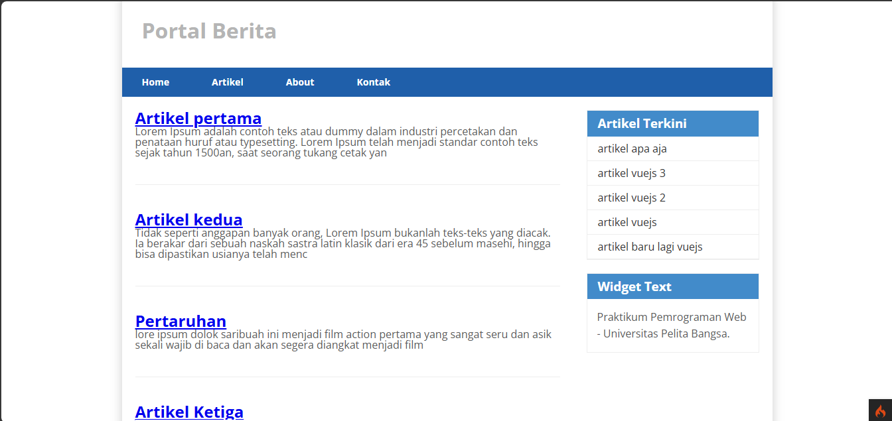

### 2. Praktikum 4: Sistem Login dan Authentication (Filter)
Fokus pada pengamanan rute dashboard admin.
* **Penjelasan Teknis:** Sandi admin diamankan menggunakan fungsi `password_hash()`. Untuk proteksi rute, digunakan `FilterInterface` pada `Routes.php`. Jika pengguna mencoba mengakses halaman `/admin` tanpa sesi login yang valid, sistem (*Filter*) akan otomatis mencegatnya dan me-redirect kembali ke halaman login.
* **Tampilan Form Login:**
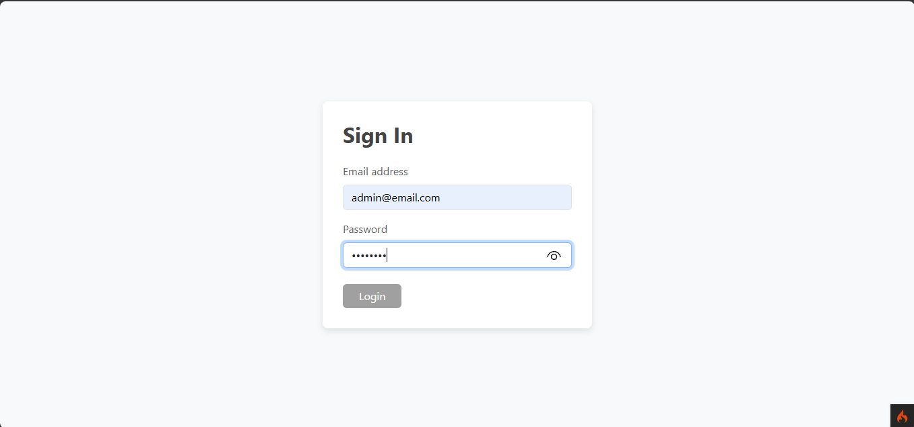
* **Tampilan Dashboard Admin (Setelah Login):**
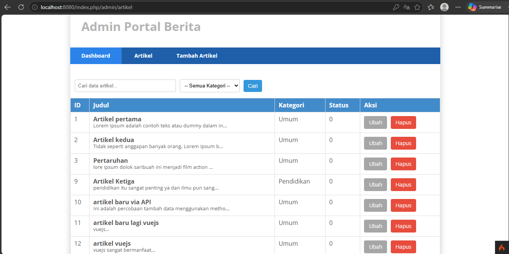

### 3. Praktikum 5 & 6: Pagination, Search & Relasi Tabel
Mengelola data dalam jumlah besar dan mendalami arsitektur relasional database.
* **Penjelasan Teknis:** * **Pagination & Search:** Memanfaatkan library bawaan CI4 `$builder->paginate()` untuk membatasi data per halaman, dan `$builder->like()` untuk pencarian berbasis Query Builder.
  * **Relasi Tabel:** Membuat relasi *One-to-Many* antara tabel `kategori` dan `artikel`. Pengambilan data dilakukan dengan fungsi `->join()` agar nama kategori bisa tampil bersama data artikel tanpa perlu query berulang.
* **Tampilan Form dengan Kategori:**
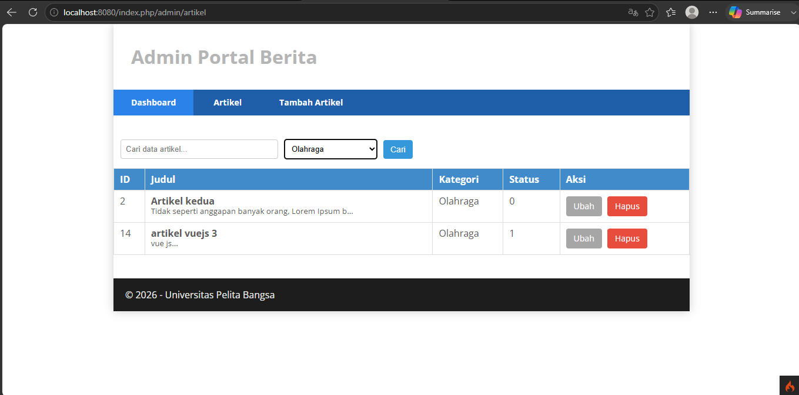

### 4. Praktikum 7: Upload File Gambar
* **Penjelasan Teknis:** Memodifikasi tag `<form>` dengan atribut `enctype="multipart/form-data"` agar dapat memproses file biner. Di sisi Controller, file gambar ditangkap menggunakan `$this->request->getFile()`, divalidasi, lalu dipindahkan (move) ke direktori `public/gambar`.
* **Tampilan Form Upload:**
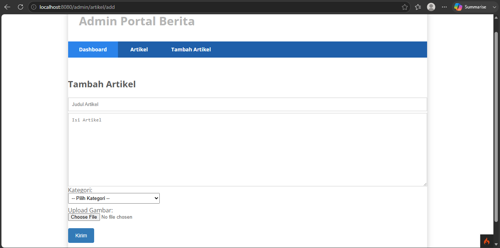

---

## FASE 2: INTERAKTIVITAS DENGAN AJAX

### 5. Praktikum 8 & 9: Implementasi AJAX, Pagination, & Search
Mengubah metode *reload* halaman tradisional menjadi *Asynchronous* (tanpa muat ulang).
* **Penjelasan Teknis & Alur Kerja:** Pencarian dan pemuatan halaman dilakukan melalui **jQuery AJAX**. Saat *user* mengetik pencarian, JavaScript mengirim request ke CodeIgniter. Di sisi server, method `admin_index()` mengecek apakah request tersebut adalah AJAX menggunakan `$this->request->isAJAX()`. Jika ya, server mengembalikan data dalam format **JSON** (bukan me-render View HTML). JavaScript kemudian menangkap JSON tersebut dan menggambar ulang (`render`) isi tabel secara *real-time*.
* **Tampilan Search & Pagination AJAX:**
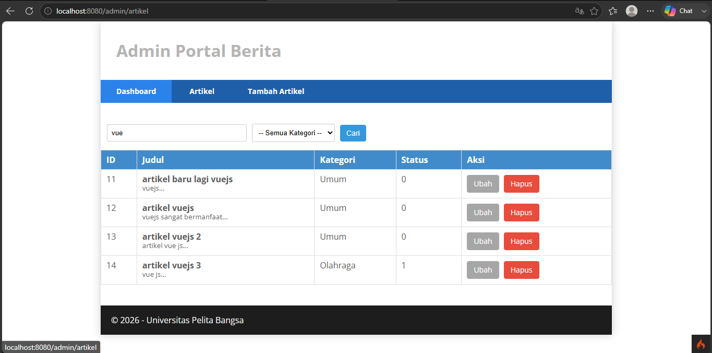

---

## FASE 3: REST API, SINGLE PAGE APPLICATION (VueJS) & SECURITY

### 6. Praktikum 10: Pembuatan RESTful API CodeIgniter
Mengubah arsitektur aplikasi menjadi penyedia layanan data (REST Server).
* **Penjelasan Teknis & Alur Kerja:** Membuat controller `Post.php` yang meng-extend `ResourceController` dan memanfaatkan `ResponseTrait` untuk mempermudah format balasan berupa JSON . Rute API didaftarkan secara otomatis menggunakan `$routes->resource('post');` yang langsung menghasilkan *endpoint* untuk metode GET, POST, PUT, dan DELETE. Pengujian fungsionalitas CRUD API dilakukan secara terpisah tanpa antarmuka web menggunakan aplikasi REST Client seperti **Postman** [cite: 1804-1805, 1965-1966].
* **Tampilan Uji Coba API (Postman):**
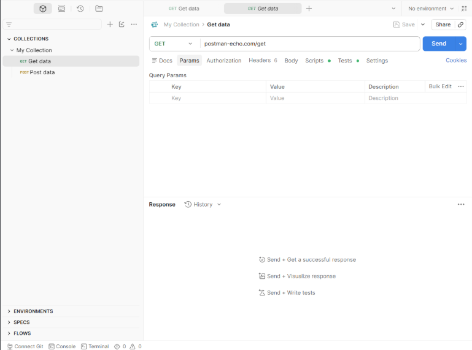

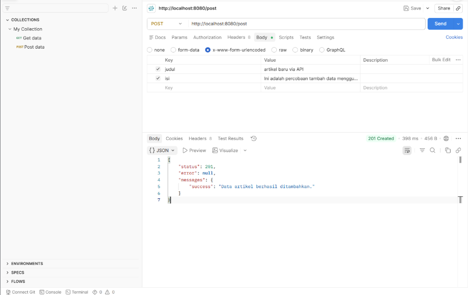

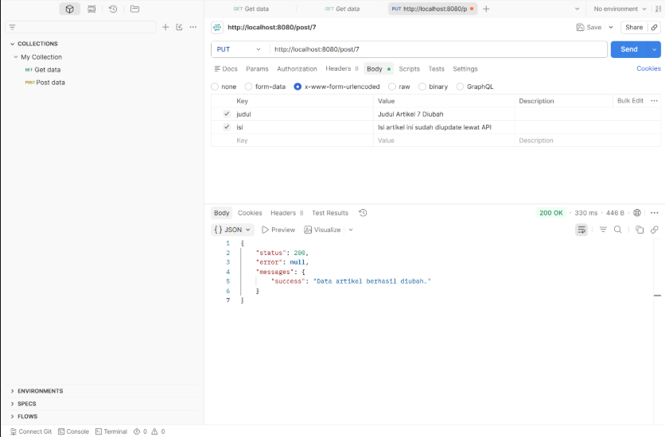

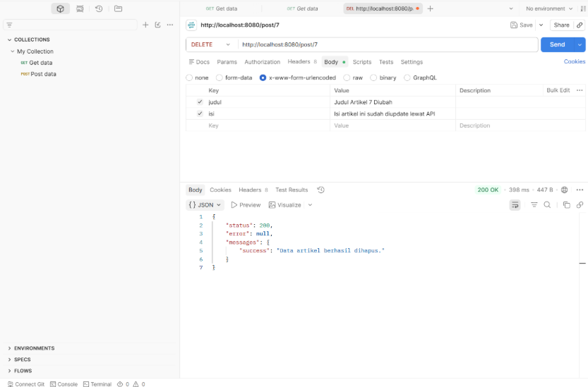

### 7. Praktikum 11 & 12: Integrasi VueJS dan Vue Router (SPA)
Memisahkan sepenuhnya *Frontend* (VueJS) dan *Backend* (CodeIgniter 4 REST API).
* **Penjelasan Teknis:** Aplikasi diubah menjadi *Single Page Application* (SPA) menggunakan **Vue Router**. UI dipecah menjadi komponen modular (`Home.js`, `Artikel.js`, `About.js`). Vue Router bekerja dengan menukar (me-mount) komponen-komponen tersebut ke dalam tag `<router-view>` berdasarkan URL yang diakses. Hal ini membuat perpindahan antar halaman menjadi instan seperti aplikasi *mobile*, sementara data CRUD ditarik melalui REST API (`/post`) menggunakan **Axios**.
* **Tampilan Menu About SPA:**
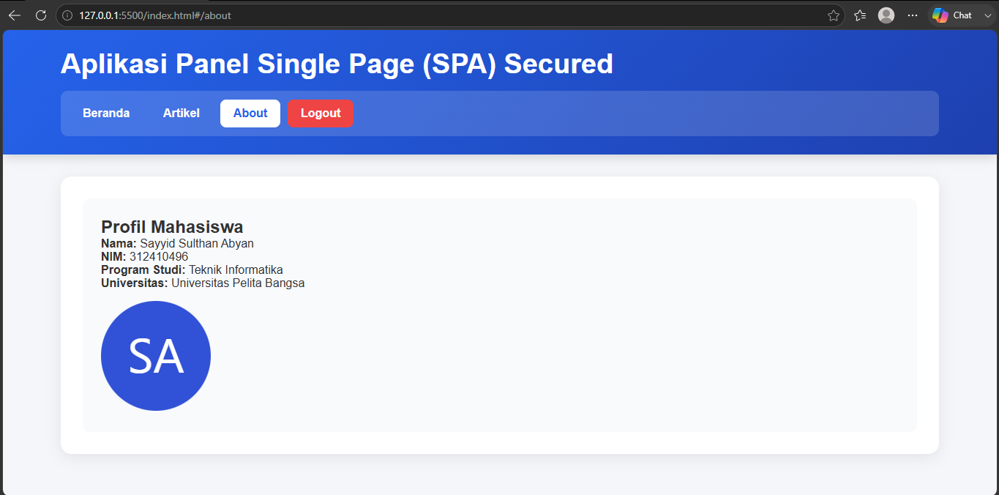

### 8. Praktikum 13: VueJS Autentikasi & Navigation Guards
Menerapkan perlindungan sisi klien (*Client-Side Security*).
* **Penjelasan Teknis:** Menggunakan fungsi `router.beforeEach` pada Vue Router yang bertindak sebagai "Satpam Frontend". Setiap kali pengguna berpindah rute yang memiliki label `requiresAuth: true`, sistem akan mengecek keberadaan token login di `localStorage`. Jika tidak ada, pengguna diblokir dan diarahkan ke form Login.
* **Tampilan Form Login VueJS:**
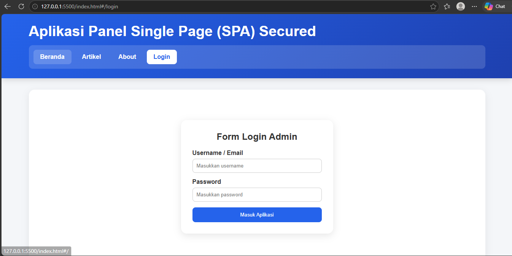

### 9. Praktikum 14: Keamanan API, Token Auth, & Axios Interceptors
Menerapkan perlindungan sisi server (*Server-Side Security*) berlapis untuk mencegah *bypass* database.
* **Penjelasan Teknis & Alur Kerja:**
  * **CodeIgniter Filters (Backend):** Dibuat filter `ApiAuthFilter` yang mencegat request POST/PUT/DELETE. Server mengecek apakah *Request Header* membawa `Authorization: Bearer <token>`. Jika tidak valid, server mengembalikan respon `401 Unauthorized`.
  * **Axios Interceptors (Frontend):** Bertindak sebagai "kurir rahasia". Daripada menyisipkan token secara manual di setiap fungsi CRUD, `axios.interceptors.request` mencegat setiap request keluar dari VueJS dan secara otomatis menyuntikkan *Token* ke dalam *HTTP Header* sebelum dikirim ke server.

**Hasil Uji Coba Keamanan Lapis Ganda:**
* **Bukti API Ditolak via Postman (Tanpa Token):** Server CI4 berhasil memblokir akses ilegal.
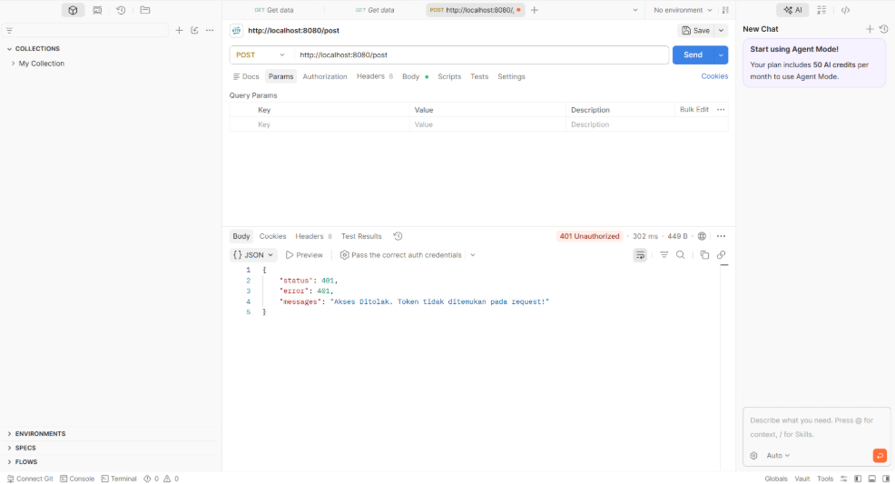
* **Bukti API Diterima via VueJS (Dengan Interceptors):** Akses diterima secara transparan berkat token otomatis.
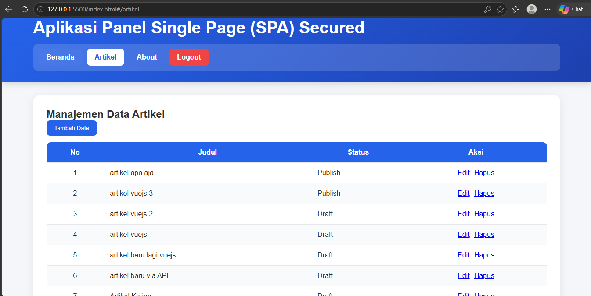

---

## Kesimpulan Analisis Keamanan (Client-Side vs Server-Side)
Dari hasil implementasi di atas, terdapat perbedaan mendasar pada sistem keamanan yang dibangun:
1. **Navigation Guards (VueJS / Client-Side):** Hanya mengunci antarmuka (UI). Mencegah user awam melihat halaman web tertentu, namun rentan dibypass oleh pihak yang menembak langsung ke URL API.
2. **Filters & Token Auth (CodeIgniter / Server-Side):** Mengunci akses data inti di *Backend*. Meskipun UI frontend berhasil dibypass atau diserang via aplikasi pihak ketiga (seperti Postman), *database* tetap aman karena server secara ketat menolak request tanpa Token yang sah.

Penggabungan keduanya menghasilkan aplikasi web modern yang responsif namun memiliki benteng keamanan yang kokoh.

---
*Sayyid Sulthan Abyan - Teknik Informatika - Universitas Pelita Bangsa*
